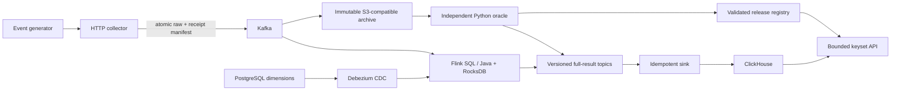

# AdPulse

A stateful advertising-measurement backend with auditable collection, event-time attribution, bounded OLAP APIs and immutable replay releases. Synthetic data only; a locally validated portfolio implementation with AI assistance.

[中文说明](README.md) · [Architecture](docs/architecture.md) · [Query contract](docs/query-api.md) · [Operations evidence](docs/operations-validation.md) · [Scaling measurements](docs/scaling-validation.md) · [60-second demo](docs/demo/adpulse-local-demo.mp4)



The collector acknowledges only after a Kafka transaction commits both the raw events and their receipt manifest. Two Flink jobs validate and deduplicate input, join advertising events using event time, and emit full metric/association snapshots. ClickHouse reads the latest offset per complete key before applying mutable status filters. Signed cursors pin a validated release; live pagination explicitly does not promise a cross-page MVCC snapshot.

Replays verify archived input and source lineage, compute an independent oracle, publish an immutable result release and verify sink visibility before promotion. PostgreSQL serializes active-release changes and keeps their audit trail. Prometheus/Grafana expose freshness, quality, lag, checkpoints and query budgets.

## Run

Requirements: Docker Engine/Compose, Python 3.12, Java 17, Maven and uv. Reserve at least 12 GB memory for a fresh complete development stack; retained archives, indexes and disk-reference workspaces need additional disk capacity.

```bash
make setup
make verify
make up
make smoke
```

Grafana: `http://localhost:13000/d/adpulse-overview` (`admin` / `adpulse-local`). API: `http://localhost:8080/docs`. Flink: `http://localhost:18081`. All published ports bind loopback; credentials are synthetic local defaults.

Do not recreate JobManager with empty state after a release has produced output. Follow the [savepoint recovery runbook](docs/runbook.md). The bootstrap intentionally rejects an empty-state restart of an existing validated release.

## Evidence

- Flink **1.20.3 → 1.20.5**: both jobs restored strict savepoints and completed new checkpoints. ClickHouse **24.8 → 26.3 LTS**: cold-cloned data, retained the old volume and matched SHA-256 fingerprints for all five business tables.
- Migration acceptance reconciled **128,188** acknowledged synthetic records, **1,211** metric keys and **21,672** associations against the independent oracle.
- Isolated three-broker Docker experiment: a leader SIGKILL recovered to a new acknowledgment in **12.007 s**; loss of quorum returned **503**; **124** acknowledged raw records matched their transactional manifests after recovery.
- Bounded query regression checks include real PostgreSQL pointer races, latest-state filtering, immutable-release traversal and server-side budget rejection. Earlier measured first-page performance is retained with its original runtime and limitations in [query validation](docs/refresh-validation.md).

- Completed two 30-minute local input runs. The **1,000 events/s capacity profile** used two **8 GiB Flink process budgets** and attribution parallelism 6: **1,800,211** synthetic receipts all visible at **19.370 s P95**. Earlier 100/s validation used smaller process budgets; this is not a same-resource speedup comparison.
- Reconciled **3,833,704** cumulative acknowledged records, **6,538** metric keys and **646,242** associations, including all failed load attempts.
- The earlier **70-test snapshot** and [hosted Docker CI](https://github.com/JDinSeattle/AdPulse/actions/runs/34075884766) passed, including real large-batch conflict/retry checks, an occupied-worker SIGKILL and crash-after-write/before-offset-commit sink replay.

- **0.3.0:** disk-backed reference containers and verified receipt indexes, timestamped background inspection with explicit failure/expiry, and a four-query limit per API process. **91 Python/Java regressions** pass locally and in [hosted Docker CI](https://github.com/JDinSeattle/AdPulse/actions/runs/34082912455), including real inspection, failure/expiry and projected-reference query acceptance.
- Three alternating pairs on identical **2 CPU / 4 GiB / no-swap** Docker budgets and a frozen **200,000-record** fixture produced identical complete output hashes. Median process peak RSS fell **86.3%** (987 → 135 MiB), at **2.29× elapsed time** and about **605 MiB** scratch disk. This is a memory/time tradeoff, not a throughput speedup.
- Indexed/cached HTTP diagnostics remove per-request ClickHouse calls. [Serving measurements](docs/evidence/scaling/paired-serving.json) separately report setup/refresh and request costs; their staleness semantics and synthetic archive scope are explicit.

Full reports, experiment methods, rejected attempts and CI provenance are in [operations validation](docs/operations-validation.md). A single-host replica experiment is not a physical-host failure test. Default Compose still uses one Kafka broker and no JobManager HA; no production, managed-cloud, 26-hour capacity, cloud-cost or ML-serving claim is made.

## Reproduce fault and load tests

```bash
# Independent three-broker lab; defaults to collector port 28088.
.venv/bin/python scripts/quorum_drill.py
# Stop only that lab, retain data:
docker compose -f deployment/compose.quorum.yaml stop

.venv/bin/python scripts/loadtest.py --rate 100 --seconds 1800 --output artifacts/load-100.json
# Existing validated jobs: restore retained state into the explicit capacity profile first.
.venv/bin/python scripts/capacity_restore.py --output artifacts/capacity-restore
# Reconcile the full retained input before starting this load.
.venv/bin/python scripts/loadtest.py --rate 1000 --seconds 1800 --output artifacts/load-1000.json
```

The load script refuses to overwrite reports and records per-receipt visibility, periodic resource samples and checkpoint progress. Whole-input reconciliation and steady-state performance are distinct checks. CI uses an ephemeral Docker stack and uploads its own evidence; local test results are not presented as hosted CI results.

The full disk reference reconciled **3,833,704** acknowledged synthetic inputs, **6,538** metric keys and **646,242** associations with zero differences in a 2-CPU / 4-GiB container. It took **977.3 s**, with **169.1 MiB process peak RSS**; cgroup peak including page cache reached **4 GiB**, with no OOM. This reused a verified archive index; cold indexing is excluded. See the [complete report and limits](docs/scaling-validation.md).
