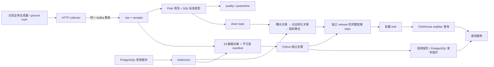

# 架构、事件契约和指标口径

## 作业边界

清洗与质量为一个作业；有状态关联与指标为第二个作业。关联按 `(advertiser_id, app_id, impression_id)` 和 `(advertiser_id, app_id, click_id)` 分两次 `keyBy`，检查 user_id 与 campaign_id。一条转化显式指定一个点击，且业务时间满足 `0 <= conversion_time - click_time <= 24h`。点击关联曝光也限定 24h，避免无界曝光状态，这是本项目补充的明确口径。

## 输入与可靠接收

事件契约的规范源为 `contracts/event.schema.json`。时间一律 UTC Unix epoch **毫秒整数**；金额一律非负最小货币单位整数，币种 ISO 风格三位大写代码，禁止浮点金额和跨币种累加。schema_version 当前为 1，新增版本须更新 schema 与冻结规则，并通过兼容性验收。

公共字段：event_id、event_type、event_time、schema_version、app_id、app_version、trace_id、advertiser_id、user_id、campaign_id。曝光补充 impression_id、ad_id、region、experiment_id、variant；点击补充 click_id、impression_id；转化补充 conversion_id、click_id、conversion_type、value_minor、currency。

业务唯一键在 advertiser_id + app_id 内按类型和对应业务 ID 去重。关联身份检查额外包含 user_id。event_id 也按 advertiser_id + app_id 隔离。相同业务键但新 event_id 是业务重复，仍应去重；同一键内容冲突当前采用第一条有效记录，并保留重复证据，不能偷偷覆盖过去。

客户端 `received_at` 由 collector 覆盖。Kafka raw 中的 wrapper 有唯一 receipt_id、batch_id、批内 index、接收时间和原始 event；业务 schema 错误仍可接收。collector 一次事务写入所有 raw 和含确切 topic/partition/offset/hash 的 receipts 清单，事务提交完成才返回 202。请求超时后可以重试，客户端必须保持 event_id / 业务 ID；HTTP client_batch_id 是追踪信息，不承诺请求级只写一次。

清洗作业为每个接收记录输出且仅输出一个 `cleaned / duplicate / quarantined / filtered` disposition。后续关联、迟到和维度问题用 `signal` 单独记录，不二次计入清洗去向。质量样本保留原始 source offset，可在归档追查。

## 三类时间边界

| 规则 | 默认 | 作用 |
| --- | --- | --- |
| Watermark 乱序容忍 | 2 分钟 | 事件时间进度 |
| 输入空闲识别 | 30 秒 | 不让无流量 partition 永久阻塞进度 |
| 转化 / 点击等待 | 2 小时事件时间 | 保留待匹配状态，超时输出具体原因 |
| 点击 / 转化业务关联 | 闭区间 24 小时 | 决定合法关联 |
| 曝光 / 点击状态保留 | 26 小时事件时间 | 业务窗口 + 迟到余量 |
| 实时去重 | 首次接收后 10 分钟处理时间 | event_id 与业务键各一层 |
| 指标窗口 | 1 分钟 | occurrence / cohort 分桶 |
| 完整值输出 | 每个脏键约 10 秒处理时间 | provisional 新鲜度 |
| raw / receipts / results topic | 7 天 | 独立于状态保留；delete，不 compact |

所有流空闲时事件时间不会凭空向前，待匹配记录可能继续停留为 pending；恢复输入后定时器继续。处理时间去重用独立定时器，推进 watermark 不会使去重提前过期。过旧事件进入 `LATE_REPLAY_REQUIRED`，已冻结指标进入 `METRIC_FROZEN_REPLAY_REQUIRED`，不以空聚合覆盖历史结果。

转化 pending → matched/unmatched 的变化保留为 Kafka 版本化输出。等待超时后到达点击不直接改写这个 live release，而是发出修正信号，使用独立回放版本。缺少曝光不等于点击转化无法关联：可合法匹配点击，但实验组为 unknown 并带曝光质量信号。

## 指标与完整键

指标键是顺序固定的 JSON 数组：advertiser_id、app_id、campaign_id、region、app_version、experiment_id、variant、currency、channel、window_start、cohort_basis、policy_version。数据库完整唯一范围还包含 release_id。规则版本通过 release 固定，每条结果同时带 rule_version。

| cohort_basis | 时间基准 | 数据 |
| --- | --- | --- |
| occurrence | 每种事件自身发生时间 | 曝光、点击、匹配 / 未匹配转化发生量 |
| impression | 曝光发生时间 | 该曝光集合的曝光数与关联有效点击数；CTR = clicks / impressions |
| click | 点击发生时间 | 点击数、匹配转化事件数、发生过转化的去重点击数；CVR = converted_clicks / clicks |
| conversion_value | 点击发生时间 + currency | 匹配转化金额、匹配转化事件数 |

一个点击多次转化只增加一次 converted_clicks，但增加多次 matched_conversions；金额按 USD、JPY 等分组，计数 cohort 使用 ALL，避免币种拆分破坏 CVR 分母。CTR 按有效点击事件数定义，一个曝光多次点击可以使 CTR 大于 1；需要“被点击曝光占比”时应新增政策版本，不能在服务端静默换口径。

实验组始终来自发生时的曝光；维度 CDC 仅补充 channel，不能改写历史实验分组。无曝光、样本量小于 100 等情况下 API 给出质量状态，不产生统计显著性结论。

## 历史维度

PostgreSQL 保存 campaign_id、effective_from、effective_to、source_version、attributes。Debezium 使用 pgoutput、源端显式 publication、独立 replication 账号和 initial snapshot。快照记录不改变 effective_from。Flink 按业务时间找有效区间，在重叠版本中取最高 source_version；没有历史则 unknown。删除保留 before 内容，记录 deleted 版本；Kafka tombstone 是 CDC 日志清理信号，不能当作缺字段异常。

CDC 回溯变更发出 `DIMENSION_CHANGE_REPLAY_REQUIRED`，存量窗口经回放新 release 校正。dimension history 完整归档。广播维度适合这个小型实验；活动和历史版本规模增长时需按容量结果改用分区维度关联或时态维度表。
