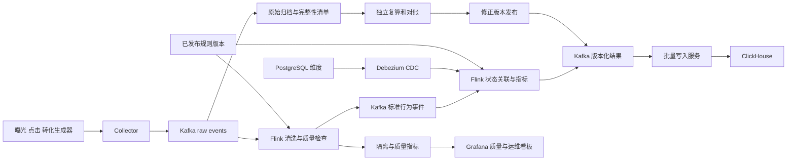

**AdPulse｜广告行为实时数仓与质量治理平台**

项目方向文档 v1.0 · 2026-09-06 · 建议仓库名：`adpulse`

**项目定位。** 面向短视频广告的曝光、点击、转化事件，建设可回放、可校正、可监控的 Flink 实时数据链路，服务广告运营、实验分析和数据平台维护。主线是行为数据接入、标准化、事件关联、指标产出、质量治理和生产恢复。

本项目根据字节跳动／TikTok 的公开岗位与工程分享设计。公开事实是需求依据；广告规则、时间窗口、流量规模、表设计和组件组合是本项目假设，不代表掌握或复刻字节内部现行系统。本文件为待实施方案，尚无性能实测结论。

**为什么采用这个生产场景。** 本次查阅的 TikTok 官方岗位 `Data Engineer Graduate (Monetization Data) – 2027 Start`，地点 San Jose、职位编号 A247327，明确涉及用户行为、广告和商业化的批流管道，广告衡量与实验分析数据，以及质量、延迟、成本和平台可靠性，并列出 Spark、Flink、Hive、Kafka。岗位名称指向 2027 入职，并非发布年份；2026-09-06 打开时能读取正文与申请入口。[官方岗位](https://lifeattiktok.com/search/7668550561096665397)

字节数据平台团队公开的埋点治理实践涉及字段类型错误、丢失重复、慢节点、反压及消息系统压力；这些是本项目安排故障演练和质量检查的直接参考。[埋点数据流治理实践](https://developer.volcengine.com/articles/7317473930380640294)

| 公开证据 | 可以确认的需求 | 本项目的对应设计 |
| --- | --- | --- |
| [TikTok Monetization Data 岗位](https://lifeattiktok.com/search/7668550561096665397) | 广告行为批流处理、指标、实验、质量、成本和可靠性 | 曝光／点击／转化数据产品与质量看板 |
| [字节 MQ-Hive 实时集成分享](https://developer.volcengine.com/articles/7599493625969377331) | 入仓时效、源端与 sink 交付语义、分区就绪、脏数据和运行指标 | 原始数据归档、完整性清单、checkpoint 恢复和隔离区 |
| [字节埋点数据流治理分享](https://developer.volcengine.com/articles/7317473930380640294) | 埋点质量、资源竞争、消息写入和负载治理 | schema 检查、丢失／重复监控、热点与慢节点实验 |
| [字节 Flink SQL 流式质量监控分享](https://developer.volcengine.com/articles/7317465954244853769) | 使用流计算产出数据质量监控能力 | 独立质量指标、规则版本、异常证据与告警 |

技术分享描述的是文章所述时期的实践。文中出现的 BMQ、Databus、YARN 改造和内部平台，并不等于本项目必须实现或字节所有团队当前都采用。这里用可获取的开源组件复现相同问题类型；使用 S3 类对象存储时，也不直接照搬 HDFS 的文件 rename 提交方式。

**生产业务与消费者。** 假设短视频平台的广告展示与客户端点击由埋点链路上报，广告主的站点或应用通过服务端回传转化。移动网络会延迟或重复投递，转化可能在点击很久之后才发生；广告活动的属性和实验配置也会变化。

| 使用者 | 生产问题 | 需要的数据产品 |
| --- | --- | --- |
| 广告运营 | 某广告流量突然下降，是业务变化还是数据没到？ | 分活动、国家、应用版本的实时行为与质量趋势 |
| 实验分析人员 | 两个实验组的曝光、点击、转化口径是否一致？ | 带明确 cohort 和版本的实验分析数据 |
| 衡量／分析团队 | 转化晚到、重复或找不到点击时怎样解释？ | 可追溯的转化关联明细与未匹配原因 |
| 数据平台值班 | checkpoint 失败、反压、Kafka 积压从哪里开始？ | 链路指标、故障定位手册和恢复证据 |

第一版交付广告衡量数据和异常提示。投放竞价、实时扣费、广告排序模型和完整实验统计检验分别属于后续系统；本项目产生它们可能消费的可靠数据。

**技术栈与职责。**

| 层次 | 选型 | 用途 |
| --- | --- | --- |
| 数据生成与接入 | Python 业务状态生成器、轻量 HTTP collector | 有关联的曝光点击转化、重试、乱序和流量分布 |
| 消息层 | Apache Kafka | 原始事件、清洗事件、维度变更、版本化结果与回放 |
| 流处理 | Apache Flink SQL + Java DataStream | SQL 做标准转换／质量查询；Java 实现有状态关联、定时器和结果修正 |
| 状态与恢复 | Embedded RocksDB state backend、持久化 checkpoint/savepoint | 有界去重、关联等待、故障恢复和状态升级实验 |
| 数据契约 | JSON Schema 起步 | 事件类型、字段类型、兼容性检查；压测后再决定是否切 Avro/Protobuf |
| 业务维度 | PostgreSQL + Debezium | 活动属性及其显式生效时间的 CDC |
| 结果服务 | ClickHouse + 小型批量写入服务 | 活动／实验指标查询，处理重放后的逻辑去重 |
| 原始归档 | S3 或本地兼容对象存储 | 完整输入、隔离数据、回放清单 |
| 观测与交付 | Prometheus、Grafana、Docker Compose、CI | 运维和质量看板、部署、回归与故障演练 |
| 批量核验 | Python／DuckDB 小样本参考实现 | 与 Flink 独立的正确性 oracle；大数据复算后续接 LakeBridge |

固定一套经过集成验证的 Java/Flink/Kafka connector/Debezium/ClickHouse 版本，并记录序列化兼容性与镜像摘要。Java 版本以选定 Flink 发行版支持范围为准。生产风格来自验证完整性，版本号本身不能证明生产可用。

**架构与作业边界。**

先实现两个职责清晰的 Flink 作业：清洗质量作业、状态关联与指标作业。后者可在瓶颈明确后拆成关联与聚合两个作业。指标结果通过 Kafka 解耦 ClickHouse 写入；原始归档独立监控完整性，不能因为主链路成功就假设归档也已完成。

**事件契约与关键表。**

| 类型 | 关键字段 | 业务主键／约束 |
| --- | --- | --- |
| 公共 envelope | event_id、event_type、event_time、received_at、schema_version、app_id、trace_id | event_id 标识同一事件的重投；同时检查各类型业务键 |
| 曝光 | impression_id、ad_id、campaign_id、advertiser_id、region、experiment_id、variant | advertiser_id + impression_id |
| 点击 | click_id、impression_id、campaign_id、event_time | advertiser_id + click_id；携带曝光关联键 |
| 转化 | conversion_id、click_id、conversion_type、value_minor、currency | advertiser_id + conversion_id；同一转化重投不能重复计入 |
| 活动维度变更 | campaign_id、effective_from、effective_to、source_version、attributes | 业务有效版本；CDC 到达时间与生效时间分开 |
| 关联结果 | conversion_id、click_id、status、reason、policy_version、release_id | 同一发布版本内一个转化对应一个最终逻辑状态 |
| 指标结果 | metric_key、window_start、cohort_basis、release_id、values、status | 完整键包含维度、窗口、cohort 和发布版本 |
| 质量记录 | rule_id、event_id、dataset、error_code、sample_ref、rule_version | 可聚合统计，同时能定位具体错误样本 |

数据集只使用模拟广告、模拟活动和合成标识。生成器保存独立 ground truth，包含真实发生顺序和预期关联；用于给输入注入传输层错误之后的验收。客户端 collector 在 Kafka 持久化确认后才返回已接收；HTTP 请求成功不应早于本项目定义的可靠接收点。

完整性监控以 collector 已确认接收的批次／事件清单为入口，分别核对清洗成功、合法过滤、隔离和下游待处理记录。原始 topic 采用时间／容量保留，不启用会移除历史事件的 log compaction。对于 SDK 从未上报的事件，只能依赖独立源端计数、序列或业务对账发现；没有这类证据时，流量下降只能视为异常信号，不能直接认定丢失。Kafka offset 也不直接相减作为业务记录数。

**广告口径与时间规则。** 以下是为项目定义的规则，均不宣称为 TikTok 官方归因规则。

1. 第一版转化携带显式 click_id，关联同广告主、同业务身份范围内的点击；要求点击不晚于转化，且发生时间差不超过 24 小时。一个转化只能关联一个点击，无法关联要保留原因。多触点、跨设备和浏览归因以后扩展。
2. 点击可晚于转化到达系统；先保存待匹配状态，等待关联数据。超过等待范围后输出未匹配状态，后续到达的数据交给修正流程，保留状态变更审计。
3. 普通曝光／点击以 2 分钟乱序容忍作为初始实验配置；转化与关联数据允许更长的到达延迟，初始按 2 小时设计。watermark、业务 24 小时关联窗口和状态清理期限是三个不同概念。
4. 点击关联状态按业务窗口加迟到余量估算保留期，初始约 26 小时，再根据观测调整；实现时明确使用事件时间清理定时器和处理时间 TTL 的各自边界，不能把两者视作等价。
5. 实时去重先承诺 10 分钟业务重复范围；更晚的重复通过持久化原始记录和完整业务键对账校正。若目标变成 24 小时内实时严格去重，必须扩大状态、压测容量并更新 SLO。
6. 原始事件持续保留到能够完成回放与校正；初版实验按 7 天规划，实际按容量调整。原始记录保留期、Kafka 保留期和状态保留期分别定义。
7. 实时指标标识 `provisional`，窗口按 watermark 可结束流式等待，但不等于业务数据永远完整。每天复算受影响窗口，晚于冻结时间的合法数据走新修订版，旧版本仍可追查。

用于展示的指标包括曝光发生量、点击发生量、匹配／未匹配转化、转化价值、去重率、迟到率和字段异常率。CTR 与 CVR 必须来自统一 cohort：曝光 cohort 的点击率使用归属该曝光集合的有效点击；点击 cohort 的转化率使用其中发生过转化的去重 click_id。一个点击多次转化时，转化事件数与转化点击数分开记录。禁止把本分钟曝光与历史点击对应的本分钟转化直接相除，伪装成完整漏斗。

实验组使用曝光时携带的实验分组，后续点击／转化沿关联传播，不能用客户当前分组改写过去。无法关联到曝光的事件进入质量统计。小样本比例、缺失曝光或分组异常先显示数据质量状态，不自动下结论说实验效果显著。

**Flink 的核心技术难点。**

| 难点 | 设计要求 | 验收重点 |
| --- | --- | --- |
| Watermark 和空闲分区 | 配置空闲识别并监控各输入 watermark；恢复输入的迟到事件有去处 | 一个分区无流量时其他窗口仍前进；恢复后不静默丢数据 |
| 多流关联 | 明确关联键、时间边界、待匹配状态与超时状态 | 转化先到、点击后到，以及不合法时间关系 |
| 历史维度 | 使用源端有效版本；初始快照不伪造过去不存在的维度历史 | 活动属性回溯变更不会永久污染旧指标 |
| 去重与状态 | event_id 和业务键分开；记录状态大小、唯一键率与保留期 | 去重范围内重复为零，范围外修正结果有证据 |
| 热点活动 | 无状态阶段可重分布；可结合聚合先分盐再汇总 | 不能给有状态 click_id 关联随意加随机盐 |
| 规则发布 | 配置有 schema、版本、生效边界和回退版本；回放固定规则版本 | 不同规则结果隔离比较，不能悄悄混在一个指标里 |
| 状态升级 | 固定 operator UID，验证序列化兼容、savepoint 恢复和扩缩并行度 | 恢复后不是悄悄以空状态重算 |
| 暂估与修正 | 输出完整替换值，修正旧维度键时也输出旧键更新／归零 | 修正归属后旧活动不会残留贡献 |

规则第一版只允许声明式字段映射、类型检查、过滤、路由和阈值配置。按发布版本固定快照；热更新作为第二阶段，须记录每条结果采用的规则版本。重新关联或改变口径时优先做独立回放版本，验证后切换，避免一次无记录的动态配置改变所有历史解释。

**交付语义与 ClickHouse 正确性。** Flink 状态一致性、Kafka 事务可见性和最终数据库逻辑结果分别验证。Kafka 到 Kafka 可以在连接器、checkpoint、事务和 `read_committed` 配置匹配时验证相应交付保证；ClickHouse 写入服务仍可能重试，业务事件本身也可能重复。[Flink Fault Tolerance Guarantees](https://nightlies.apache.org/flink/flink-docs-stable/docs/connectors/datastream/guarantees/)

指标 topic 每条消息携带完整聚合值，而非不可去重的 `count += 1`。同一 `release_id + metric_key` 固定落在同一个 Kafka partition。写入 ClickHouse 时保存该 partition 的 output_offset 作为该键的顺序；重复消费同一 offset 必须得到同一内容。改变分区策略或重新回放时创建独立 release/topic，不跨分区比较 offset。

ClickHouse 使用带版本的结果表；查询先按完整业务键取最新完整值，再做聚合。ReplacingMergeTree 的后台合并不能当作即时唯一约束，服务层需使用经过验证的 `FINAL` 或 `argMax` 查询。重放输入也不能直接进入会重复累加的增量物化视图。[ClickHouse ReplacingMergeTree](https://clickhouse.com/docs/reference/engines/table-engines/mergetree-family/replacingmergetree)

一次全量修正形成新的 release，消费者明确读取哪个发布版本；验收完成后再切换活动版本。保存旧版本用于比较。Kafka output_offset 只用于单键同分区内的先后关系，不充当全系统事务号。实时写入、原始归档和版本切换的完成状态分别监控。

**工作中可能遇到的生产问题与处理方式。**

| 问题 | 现象和定位证据 | 处置与长期修复 | 项目演练 |
| --- | --- | --- | --- |
| 转化比点击先到 | 未匹配比例突然升高，随后点击到达 | 等待状态、事件时间边界、后续修正与对账 | 打乱传输顺序，保留真实发生时间 |
| 客户端大量重试 | 输入增多但业务没有增长 | event_id／业务键去重、重复率监控 | 同事件重投，另造新 event_id 的同业务键重复 |
| SDK 字段类型变更 | 某 app_version 的坏记录猛增 | schema 隔离、按版本适配、修复后回放 | 数字字段变字符串并与正常流量混合 |
| 空闲 Kafka partition | 部分窗口不出结果、全局 watermark 停滞 | idle 识别；恢复后迟到处理；排查源端 | 一个分区暂停并恢复 |
| 大活动导致热点 key | 个别 subtask busy／backpressure 高 | 区分关联和可结合聚合，后者两阶段分摊 | 让一个 campaign 承担大部分输入 |
| Sink 变慢 | 下游 lag 上升，随后全链路反压 | 从 sink 向上定位；批量写入、限并发、留足保留期 | 暂停 ClickHouse 写入服务 |
| Checkpoint 写入毛刺 | checkpoint 时长上升、超时重启 | 检查状态量、存储延迟与 barrier；有证据再调配置 | 对测试 checkpoint 存储施加延迟 |
| 重启后计数变大 | 任务恢复成功但数据重复 | 查询语义去重、完整值替换、输出顺序验证 | 写入成功但提交消费位点前杀进程 |
| 活动维度晚到 | 同活动历史数据被错误归类 | 保留有效版本，回放修正，更新旧键贡献 | 延迟 CDC 并回溯修正生效时间 |
| CDC 长时间断开 | replication slot 积压、源库存储增加 | 监控保留日志；恢复或重新快照并核对，不盲删 slot | 暂停 connector，在受限测试环境观察 |
| 规则发布错误 | 只有新版本数据量／指标突变 | 暂停推广，恢复旧版本，独立回放影响范围 | 发布错误过滤规则并演示回退 |
| Savepoint 不兼容 | 升级失败或状态无法恢复 | 提前验证 UID 和序列化；明确状态迁移或重建计划 | 修改状态结构后执行升级验证 |
| Kafka 保留期不足 | 要恢复的 offset 已不可读 | 使用已验收归档重建新 release，报告恢复范围 | 在测试 topic 缩短保留期后回放 |
| 原始归档落后 | 看板正常但历史复算缺文件 | topic/partition/offset 清单与归档完整性校验 | 阻断归档，主链路继续运行 |
| 告警风暴或无人告警 | 延迟引发大量重复告警，或质量作业自身停了 | 依赖聚合、抑制、告警恢复通知、监控作业心跳 | 故障链式传播和质量任务停止 |

如果启用 Debezium，必须验证初始快照与后续 WAL 变更衔接、删除事件以及中断恢复，不能只测试新增一行的正常路径。[Debezium PostgreSQL Connector](https://debezium.io/documentation/reference/stable/connectors/postgresql.html)

**运行指标、容量与 SLO。** 定义以下实验目标，实施后按实测修订。它们不是字节线上 SLA。

| 指标 | 初始目标或观察方法 |
| --- | --- |
| 稳态负载 | 100 → 1,000 events/s；每档先持续 30–60 分钟，资源足够再增加 |
| 暂估指标新鲜度 | 健康依赖、正常按时事件下，collector 持久化接收到查询可见的 P95 ≤ 60 秒 |
| 暂估输出方式 | 处理时间定时器约 10 秒输出完整替换值；该目标包含 Kafka 事务提交等待，并实际验证 |
| 事件时间延迟 | 另报 event_time 到结果可见的分布；人工迟到不能混入系统处理延迟后不加说明 |
| 正确性 | 定义范围内的去重、关联和修正结果与独立 oracle 一致；隔离／未匹配原因全部可解释 |
| 单 worker 中断 | 在固定配置下争取 5 分钟内恢复并追赶；分别报告恢复启动时间与 lag 归零时间 |
| 质量检测 | 坏 schema、重复，以及有接收清单可核对的链路遗漏，目标在 2 分钟内触发告警或质量信号 |
| 成本效率 | 记录每百万事件 CPU 时间、存储读写量、checkpoint 大小及实际云用量 |

容量计划记录事件大小、每秒唯一键数、点击／转化比例、状态保留时长、实际序列化字节数和 RocksDB 磁盘开销。高吞吐与长状态保留共同决定资源，不以“每秒能读多少消息”替代稳态容量结论。长时间边界用明确缩短的实验窗口或专门边界数据测试，同时保留实际长窗验证；说明 Flink watermark 不等于改变处理时间 TTL。

本地单 broker 可验证逻辑与应用恢复。验证 broker 容错时单独建立多 broker、副本及 ISR 配置的实验；同机多进程仍不能证明机房或宿主机故障下高可用。以 Kafka 可靠接收点为边界核对数据，分别报告接收失败、隔离、迟到和成功处理记录。

**实施阶段与验收。** 完整版估计 100–150 小时；比原先 SaaS 用量实时项目增加了广告关联、质量治理和 OLAP 修正的工作。

| 阶段 | 工作 | 完成条件 |
| --- | --- | --- |
| 1：契约与正确性基线 | 业务生成器、ground truth、指标口径、版本冻结 | 正常、重复、乱序和错误关联的预期结果可独立计算 |
| 2：接入和清洗 | Kafka、Flink 标准化、隔离与质量输出 | 输入记录全部有可追查去向 |
| 3：有状态关联 | 点击转化关联、去重、watermark、历史维度 | 正常／迟到／未匹配／跨边界样本正确 |
| 4：查询与修正 | 版本化结果、ClickHouse 读取、回放发布 | 重试不重复累计，旧版本不会覆盖新版本 |
| 5：运行治理 | checkpoint、监控、热点、故障演练、规则回退 | 至少完成 8 类事故演练，必须包含恢复、sink 重放、迟到与规则错误 |
| 6：交付 | 压测、运行观察、架构取舍、录屏和复盘 | 他人能复现一条正常链路、一条故障恢复和一次版本修正 |

完成标准包括：相同输入和规则版本得到相同最终业务结果；未匹配转化有原因；所有数据修正可追溯；服务端看板展示新鲜度及发布版本；恢复成功不仅看任务状态，还要检查业务主键和指标对账。

**工程产物与面试准备。** 仓库包含 generator、collector、contracts、flink-jobs、sink-writer、reference-calculation、monitoring、deployment 和 docs。文档至少包括事件契约、指标口径、状态容量估算、交付语义矩阵、规则发布与回退手册、事故演练复盘、压测记录。

准备回答：为何这个场景使用 Flink；watermark 与业务完整性有何区别；去重状态为什么有边界；转化先到如何处理；热点 key 如何拆而不破坏语义；checkpoint 成功为何还可能出现重复指标；ClickHouse 查询如何避免重算重复；口径变更时如何保证结果可解释。

完成后可写：“独立开发广告行为实时数仓，基于 Kafka、Flink SQL/Java 和 ClickHouse 实现曝光点击转化关联、版本化指标与流式质量监控；在〔实际配置〕下验证〔实际吞吐／延迟〕，并通过乱序、sink 重放、worker 中断和规则回退演练核对恢复后的业务结果。”

**与另两个项目的关系。** AdPulse 是根据字节公开需求独立设计的广告场景。LedgerFlow 继续保留 SaaS 数仓方向；LakeBridge 可通过独立 adapter 接收 AdPulse 归档作为后续扩展。三个项目可以共享部署、监控和数据契约方法，不需要虚构为同一家公司的一套现有系统。
